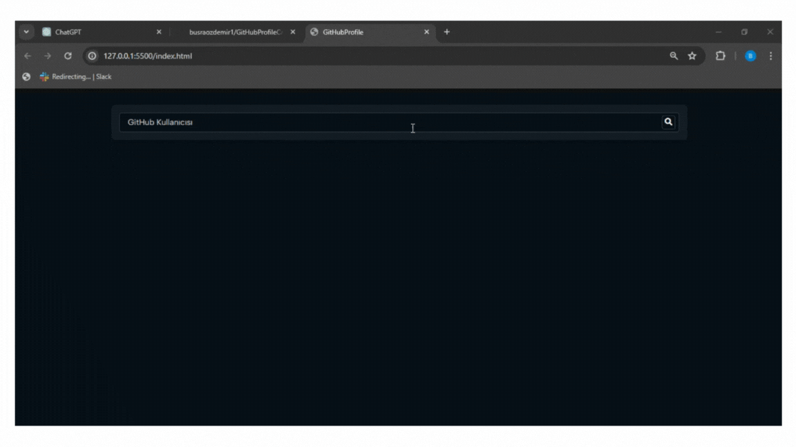

## GitHubProfileCard

- Bu proje, GitHub kullanıcılarının profil bilgilerini gösteren interaktif kartlar oluşturmayı amaçlar. HTML, CSS ve JavaScript kullanarak geliştirilmiş bu uygulama, GitHub API'sini kullanarak kullanıcı bilgilerini dinamik olarak çeker ve kullanıcı adı, fotoğraf, takipçi sayısı gibi bilgileri içeren şık bir kartta gösterir.

### Özellikler 

- Dinamik Profil Bilgileri: Kullanıcı adını girerek o kullanıcının profil bilgilerini alır.

- Responsive Tasarım: Tüm cihazlarla uyumlu olarak çalışır.

- Modern Tasarım: Şık ve sade kullanıcı arayüzü.

### Kullanılan Teknolojiler

- JavaScript

- HTML 

- CSS 

### Gif 

